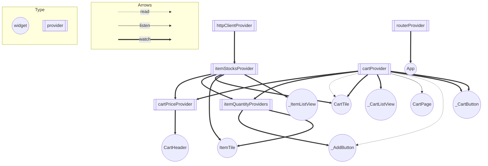

# wdb106_sample

- [WEB+DB PRESS Vol.106](https://www.amazon.co.jp/dp/4774199435?tag=mono0926-22) の特集 1 の「実践 Android/iOS アプリ設計」のサンプルを Flutter ではどう書くのかというサンプル
  - 元のサンプルは [サポートページ：WEB+DB PRESS Vol.106](http://gihyo.jp/magazine/wdpress/archive/2018/vol106/support) からダウンロード可能

## 内容概要

- 以下のパッケージを組み合わせたパターン
  - [Riverpod](https://riverpod.dev) の [flutter_riverpod](https://pub.dev/packages/flutter_riverpod)
  - [state_notifier](https://pub.dev/packages/state_notifier)
  - [freezed](https://pub.dev/packages/freezed)
- 自動テストをほぼ網羅
  - 自動スモークテスト(Widget テスト)も対応
- JSON API は http://www.mocky.io で用意
  - https://github.com/mono0926/wdb106-flutter/blob/main/response.jsonc

| 商品リスト                       | カート                       |
| -------------------------------- | ---------------------------- |
|  |  |

# Provider graph

Generated by https://github.com/rrousselGit/riverpod/tree/master/packages/riverpod_graph

