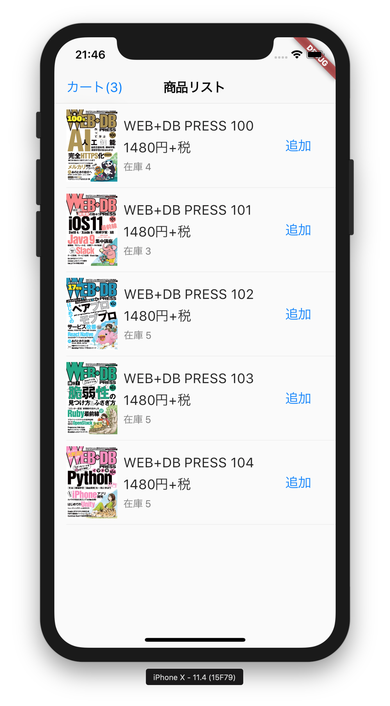
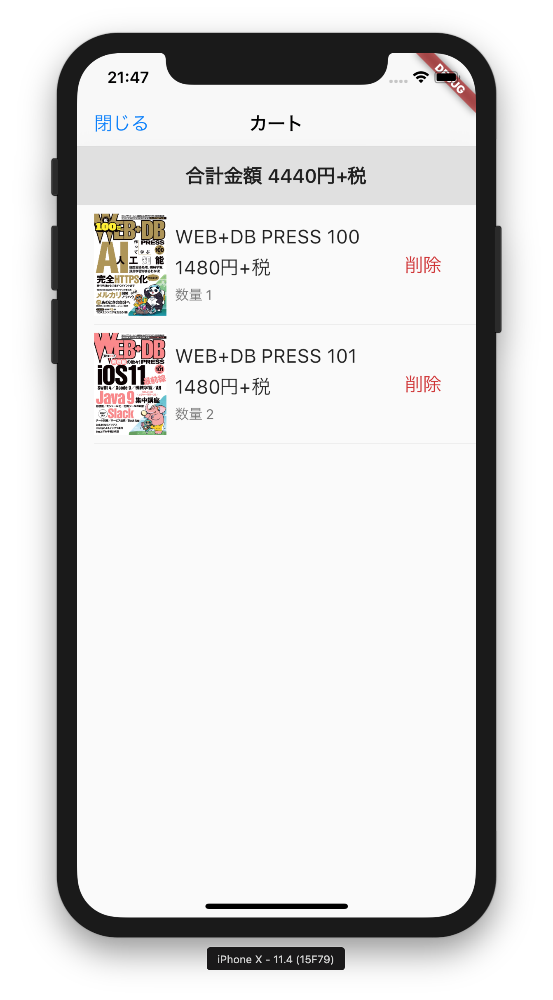

# wdb106_sample

- [WEB+DB PRESS Vol.106](https://www.amazon.co.jp/dp/4774199435?tag=mono0926-22) の特集1の「実践Android/iOSアプリ設計」のサンプルをFlutterではどう書くのかというサンプル
  - 元のサンプルは [サポートページ：WEB+DB PRESS Vol.106](http://gihyo.jp/magazine/wdpress/archive/2018/vol106/support) からダウンロード可能

## 内容概要

- 以下のパッケージを組み合わせたパターン
    - [Riverpod](https://riverpod.dev) の [hooks_riverpod](https://pub.dev/packages/hooks_riverpod)
        - [flutter_hooks](https://pub.dev/packages/flutter_hooks)は `ref.watch()` のためだけに利用
    - [state_notifier](https://pub.dev/packages/state_notifier)
    - [freezed](https://pub.dev/packages/freezed)
- 自動テストをほぼ網羅
  - 自動スモークテスト(Widgetテスト)も対応
- JSON APIは http://www.mocky.io で用意


商品リスト | カート
--- | ---
 | 

# Provider graph

Generated by https://github.com/rrousselGit/riverpod/tree/master/packages/riverpod_graph

```mermaid
flowchart TB
  subgraph Arrows
    direction LR
    start1[ ] -..->|read| stop1[ ]
    style start1 height:0px;
    style stop1 height:0px;
    start2[ ] --->|listen| stop2[ ]
    style start2 height:0px;
    style stop2 height:0px;
    start3[ ] ===>|watch| stop3[ ]
    style start3 height:0px;
    style stop3 height:0px;
  end

  subgraph Type
    direction TB
    ConsumerWidget((widget));
    Provider[[provider]];
  end
  _ListView((_ListView));
  itemIdsProvider ==> _ListView;
  _CartButton((_CartButton));
  cartTotalQuantityProvider ==> _CartButton;
  cartEmptyProvider ==> _CartButton;
  ItemTile((ItemTile));
  itemsProviders ==> ItemTile;
  itemQuantityProviders ==> ItemTile;
  _AddButton((_AddButton));
  hasStockProviders ==> _AddButton;
  cartMapProvider -.-> _AddButton;
  CartPage((CartPage));
  cartEmptyProvider --> CartPage;
  _ListView((_ListView));
  cartItemIdsProvider ==> _ListView;
  CartHeader((CartHeader));
  cartTotalPriceLabelProvider ==> CartHeader;
  CartTile((CartTile));
  itemsProviders ==> CartTile;
  cartQuantityProviders ==> CartTile;
  cartMapProvider -.-> CartTile;
  App((App));
  routerProvider ==> App;
  itemStocks[[itemStocks]];
  httpClientProvider ==> itemStocks;
  httpClientProvider[[httpClientProvider]];
  itemStockMapProvider[[itemStockMapProvider]];
  itemStocks ==> itemStockMapProvider;
  itemMapProvider[[itemMapProvider]];
  itemStockMapProvider ==> itemMapProvider;
  itemIdsProvider[[itemIdsProvider]];
  itemStocks ==> itemIdsProvider;
  itemStockProviders[[itemStockProviders]];
  itemStockMapProvider ==> itemStockProviders;
  itemsProviders[[itemsProviders]];
  itemStockProviders ==> itemsProviders;
  itemQuantityProviders[[itemQuantityProviders]];
  itemStockProviders ==> itemQuantityProviders;
  cartMapProvider ==> itemQuantityProviders;
  cartMapProvider[[cartMapProvider]];
  hasStockProviders[[hasStockProviders]];
  itemQuantityProviders ==> hasStockProviders;
  cartEmptyProvider[[cartEmptyProvider]];
  cartTotalQuantityProvider ==> cartEmptyProvider;
  cartTotalQuantityProvider[[cartTotalQuantityProvider]];
  cartMapProvider ==> cartTotalQuantityProvider;
  cartTotalPriceLabelProvider[[cartTotalPriceLabelProvider]];
  cartTotalPriceProvider ==> cartTotalPriceLabelProvider;
  cartTotalPriceProvider[[cartTotalPriceProvider]];
  itemMapProvider ==> cartTotalPriceProvider;
  cartMapProvider ==> cartTotalPriceProvider;
  cartQuantityProviders[[cartQuantityProviders]];
  cartMapProvider ==> cartQuantityProviders;
  cartItemIdsProvider[[cartItemIdsProvider]];
  cartMapProvider ==> cartItemIdsProvider;
  routerProvider[[routerProvider]];
  ```
