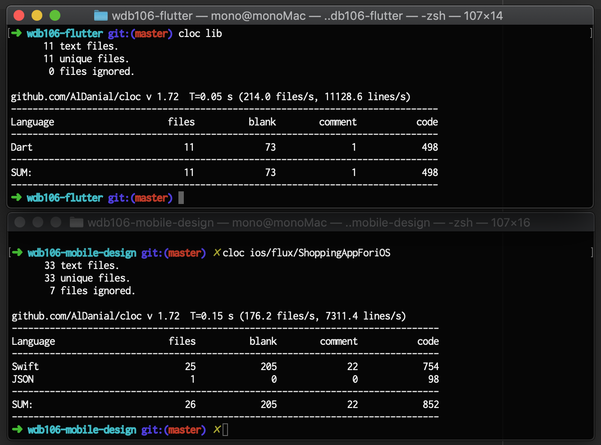

# wdb106_sample

- [WEB+DB PRESS Vol.106](https://www.amazon.co.jp/dp/4774199435?tag=mono0926-22) の特集1の「実践Android/iOSアプリ設計」のサンプルをFlutterではどう書くのかというサンプル
  - 元のサンプルは [サポートページ：WEB+DB PRESS Vol.106](http://gihyo.jp/magazine/wdpress/archive/2018/vol106/support) からダウンロード可能

## 内容概要

- BLoC(Business Logic Component)パターンを利用
- 自動テストをほぼ網羅
  - 自動スモークテスト(Widgetテスト)も対応
- JSON APIは http://www.mocky.io で用意

商品リスト | カート
--- | ---
 | 

## コード量比較(あくまで一つの目安)

- [cloc](https://github.com/AlDanial/cloc)で計測したところ、iOSネイティブのfluxサンプルのSwiftコード(Storyboardなどの画面コードは対象外)と比べて、FlutterのDartコード(画面コード込み)だと65%くらいの行数
  - (iOSネイティブのmvvmサンプルは未実装部分があったので比較する意味無し)

## Getting Started

For help getting started with Flutter, view our online
[documentation](https://flutter.io/).
